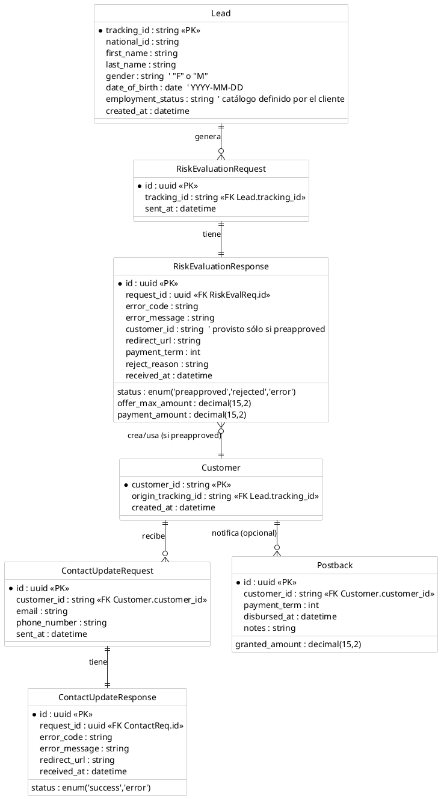
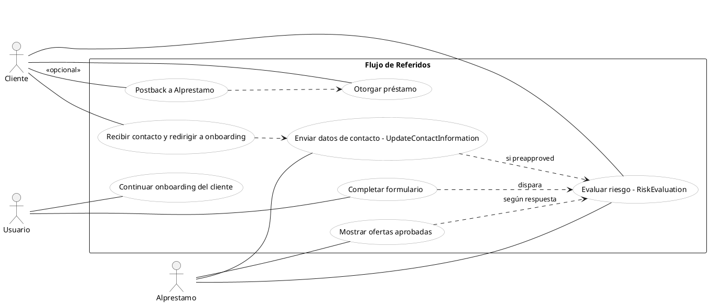

### ER simple para el módulo Alprestamo

El siguiente diagrama ER resume las entidades y relaciones necesarias para cubrir los casos del documento adjunto:
autenticación por `x-api-key`, POST `RiskEvaluation` (request/response), POST `UpdateContactInformation` (
request/response), y un posible `Postback` futuro. Incluye los campos indicados en la documentación y muestra cómo se
encadenan ambos pasos cuando la evaluación es `preapproved`.

### Correspondencia con el documento

- Paso 1 `RiskEvaluation`:
    - Request: se modela con `RiskEvaluationRequest` referenciando al `Lead` mediante `tracking_id`.
    - Response: `RiskEvaluationResponse` con `status`, `customer_id`, `redirect_url`, `offer_max_amount`,
      `payment_amount`, `payment_term`, `reject_reason`, `error_code`, `error_message`.
    - Si `status = preapproved`, se asocia/crea `Customer` con `customer_id` y se vincula al `Lead` original.
- Paso 2 `UpdateContactInformation`:
    - Request: `ContactUpdateRequest` con `customer_id`, `email`, `phone_number`.
    - Response: `ContactUpdateResponse` con `status`, `redirect_url`, `error_code`, `error_message`.
- Postback: el documento lo marca como “pendiente de documentar”; se define un placeholder `Postback` opcional con
  campos típicos de otorgamiento (`granted_amount`, `payment_term`, `disbursed_at`). Puedes ajustarlo cuando haya
  especificación oficial.

### Notas y supuestos

- `employment_status` es catálogo del cliente; aquí se trata como `string`.
- Se separan Request/Response para dejar trazabilidad y cumplir auditoría del flujo de dos pasos.
- `Customer` representa el identificador maestro del cliente externo (`customer_id`) y permite correlacionar el Paso 2 y
  futuros postbacks.
- Los montos se modelan como `decimal(15,2)`, ajusta precisión si es necesario.
- `Lead.gender` acepta "F"/"M" según el doc; si el dominio cambia, actualiza el tipo a un enum propio.

### ER simple para el módulo Alprestamo

El siguiente diagrama ER resume las entidades y relaciones necesarias para cubrir los casos del documento adjunto:
autenticación por `x-api-key`, POST `RiskEvaluation` (request/response), POST `UpdateContactInformation` (
request/response), y un posible `Postback` futuro. Incluye los campos indicados en la documentación y muestra cómo se
encadenan ambos pasos cuando la evaluación es `preapproved`.

### Correspondencia con el documento

- Paso 1 `RiskEvaluation`:
    - Request: se modela con `RiskEvaluationRequest` referenciando al `Lead` mediante `tracking_id`.
    - Response: `RiskEvaluationResponse` con `status`, `customer_id`, `redirect_url`, `offer_max_amount`,
      `payment_amount`, `payment_term`, `reject_reason`, `error_code`, `error_message`.
    - Si `status = preapproved`, se asocia/crea `Customer` con `customer_id` y se vincula al `Lead` original.
- Paso 2 `UpdateContactInformation`:
    - Request: `ContactUpdateRequest` con `customer_id`, `email`, `phone_number`.
    - Response: `ContactUpdateResponse` con `status`, `redirect_url`, `error_code`, `error_message`.
- Postback: el documento lo marca como “pendiente de documentar”; se define un placeholder `Postback` opcional con
  campos típicos de otorgamiento (`granted_amount`, `payment_term`, `disbursed_at`). Puedes ajustarlo cuando haya
  especificación oficial.

### Notas y supuestos

- `employment_status` es catálogo del cliente; aquí se trata como `string`.
- Se separan Request/Response para dejar trazabilidad y cumplir auditoría del flujo de dos pasos.
- `Customer` representa el identificador maestro del cliente externo (`customer_id`) y permite correlacionar el Paso 2 y
  futuros postbacks.
- Los montos se modelan como `decimal(15,2)`, ajusta precisión si es necesario.
- `Lead.gender` acepta "F"/"M" según el doc; si el dominio cambia, actualiza el tipo a un enum propio.

---

### Diferencia entre Lead y Customer (simple)

- Lead: persona interesada que completó el formulario en Alprestamo. Se identifica por tracking_id y aún no existe como cliente del lender.
- Customer: registro ya reconocido por el sistema del cliente/lender. Se identifica por customer_id y existe cuando la evaluación resulta preapproved.

### Diagrama de Use Case (simplificado)

