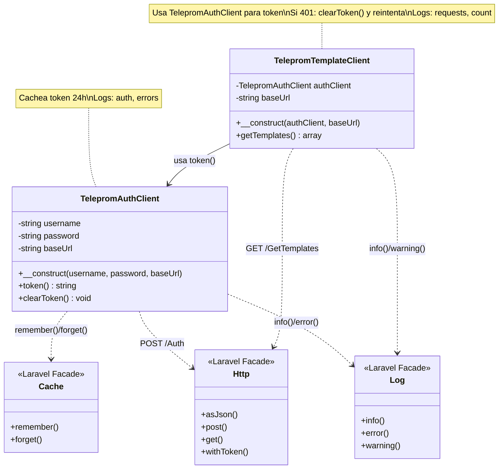

# Caso de uso: Autenticación y Plantillas con Laravel (Módulo Teleprom)

Este documento muestra la forma más simple de autenticarse contra la API de Teleprom usando Laravel 12 y de obtener plantillas. Todo el ejemplo se mantiene dentro del módulo Teleprom.

- Runtime: Laravel 12
- HTTP: `Illuminate\Support\Facades\Http`
- Cache: `Illuminate\Support\Facades\Cache`
- Log: `Illuminate\Support\Facades\Log`
- Configuración: `config('teleprom.*')` desde `.env`

---

## Configuración del módulo

El módulo lee las credenciales desde el archivo `.env` a través de `Modules/Teleprom/config/teleprom.php`:

```env
TELEPROM_USERNAME=test_username
TELEPROM_PASSWORD=test_password
TELEPROM_URL=http://teleprom:8080
```

---

## Clases del módulo

### 1. TelepromAuthClient (Autenticación)

Ubicación: `Modules/Teleprom/app/Support/TelepromAuthClient.php`

Esta clase se encarga **exclusivamente** de la autenticación y gestión del token.

```php
<?php

namespace Modules\Teleprom\Support;

use Illuminate\Support\Facades\Cache;
use Illuminate\Support\Facades\Http;
use Illuminate\Support\Facades\Log;

class TelepromAuthClient
{
    public function __construct(
        private string $username,
        private string $password,
        private string $baseUrl,
    ) {}

    public function token(): string
    {
        $cacheKey = 'teleprom.token.' . md5($this->username);

        return Cache::remember($cacheKey, now()->addDay(), function (): string {
            Log::info('Teleprom: Solicitando nuevo token de autenticación', [
                'username' => $this->username,
                'url' => $this->baseUrl . '/Auth',
            ]);

            $response = Http::asJson()->post($this->baseUrl . '/Auth', [
                'username' => $this->username,
                'password' => $this->password,
            ]);

            if ($response->unauthorized()) {
                Log::error('Teleprom: Credenciales inválidas', [
                    'username' => $this->username,
                    'status' => $response->status(),
                ]);

                throw new \RuntimeException('Credenciales inválidas de Teleprom.');
            }

            $response->throw();

            $token = (string) $response->json('token');

            if ($token === '') {
                Log::error('Teleprom: No se recibió el token en la respuesta', [
                    'response' => $response->json(),
                ]);

                throw new \RuntimeException('No se recibió el token de Teleprom.');
            }

            Log::info('Teleprom: Token obtenido y cacheado exitosamente', [
                'username' => $this->username,
                'expires' => $response->json('expires'),
            ]);

            return $token;
        });
    }

    public function clearToken(): void
    {
        $cacheKey = 'teleprom.token.' . md5($this->username);
        Cache::forget($cacheKey);

        Log::info('Teleprom: Token eliminado del cache', [
            'username' => $this->username,
        ]);
    }
}
```

### 2. TelepromTemplateClient (Plantillas)

Ubicación: `Modules/Teleprom/app/Support/TelepromTemplateClient.php`

Esta clase se encarga de obtener las plantillas y depende de `TelepromAuthClient` para el token.

```php
<?php

namespace Modules\Teleprom\Support;

use Illuminate\Support\Facades\Http;
use Illuminate\Support\Facades\Log;

class TelepromTemplateClient
{
    public function __construct(
        private TelepromAuthClient $authClient,
        private string $baseUrl,
    ) {}

    /**
     * Obtiene el listado de plantillas disponibles.
     *
     * @return array{hsms?: array<mixed>, ...}
     */
    public function getTemplates(): array
    {
        Log::info('Teleprom: Solicitando listado de plantillas', [
            'url' => $this->baseUrl . '/GetTemplates',
        ]);

        $response = Http::withToken($this->authClient->token())
            ->acceptJson()
            ->get($this->baseUrl . '/GetTemplates');

        // Si el token expiró, limpiamos cache y reintentamos una vez.
        if ($response->status() === 401) {
            Log::warning('Teleprom: Token expirado (401), limpiando cache y reintentando', [
                'url' => $this->baseUrl . '/GetTemplates',
            ]);

            $this->authClient->clearToken();

            $response = Http::withToken($this->authClient->token())
                ->acceptJson()
                ->get($this->baseUrl . '/GetTemplates');
        }

        $response->throw();

        $data = (array) $response->json();

        Log::info('Teleprom: Plantillas obtenidas exitosamente', [
            'count' => count($data['hsms'] ?? []),
        ]);

        return $data;
    }
}
```

---

## Uso desde una ruta del módulo

Puede probarlo con una ruta sencilla dentro del módulo, por ejemplo en `Modules/Teleprom/routes/web.php`:

```php
use Illuminate\Support\Facades\Route;
use Modules\Teleprom\Support\TelepromAuthClient;
use Modules\Teleprom\Support\TelepromTemplateClient;

Route::get('/teleprom/templates-demo', function () {
    // Instanciar el cliente de autenticación con valores del config
    $authClient = new TelepromAuthClient(
        username: config('teleprom.username'),
        password: config('teleprom.password'),
        baseUrl: config('teleprom.url'),
    );

    // Instanciar el cliente de plantillas
    $templateClient = new TelepromTemplateClient(
        authClient: $authClient,
        baseUrl: config('teleprom.url'),
    );

    return response()->json($templateClient->getTemplates());
});
```

---

## Notas importantes

- **Expiración:** el token dura 24 hs. Si recibe `401 Unauthorized`, `TelepromTemplateClient` limpia cache y reintenta una vez automáticamente.
- **Configuración:** Las credenciales se leen desde `config('teleprom.username')`, `config('teleprom.password')` y `config('teleprom.url')`, que a su vez obtienen los valores desde `.env`.
- **Logs:** Ambas clases registran eventos importantes (autenticación, errores, obtención de plantillas) usando `Log::info()`, `Log::warning()` y `Log::error()`.
- **Simplicidad:** El ejemplo evita dependencias adicionales y se basa en `Http`, `Cache` y `Log` nativos de Laravel.

---

## Diagrama de clases



### Notas del diagrama

- **TelepromAuthClient**: Maneja la autenticación y el token con cache de 24 horas
- **TelepromTemplateClient**: Obtiene plantillas usando el token de `TelepromAuthClient`
- El diagrama usa **Mermaid** y se visualiza automáticamente en GitHub, GitLab, VS Code y JetBrains con plugins de Markdown
